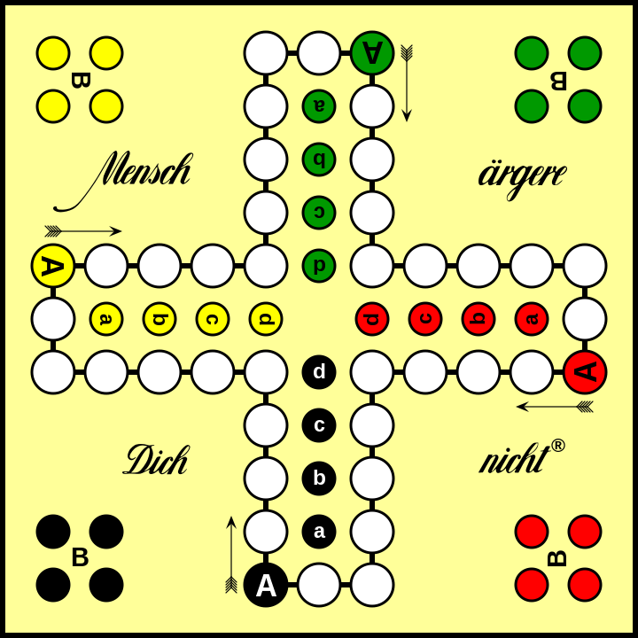

# madn-game

Mensch ärgere Dich nicht Original Spielbrett 
> Von Antonsusi - Original gameboard, CC BY-SA 3.0, https://commons.wikimedia.org/w/index.php?curid=112685275

## Projektziele
  * Projekt für die "Hausmesse" an der Walther-Rathenau-Gewerbeschule in Freiburg
  * Programmierung eines funktionierenden "Mensch ärgere Dich nicht" Spiel in Python
  * Spielbar auf selbsgebautem Spielbrett aber mit RGB LEDs als Spielfelder & Spielfiguren
  * Mit 2-4 Spielern spielbar
  * Design und Bau eines Controllers für 4 Spieler
  * Würfeln und Steuerung der Spielfiguren durch Controller für jeden einzelnen Spieler
  * 

## Unterschiede zum normalen Spiel:
  *  Schwarz lässt sich durch RGB-LEDs schlecht darstellen, daher ist Schwarz bei uns Blau
  * 

## Materialliste
- [x] 1x Raspberry-PI
- [x] 1x Starkes 5V Netzteil für Versorgung Raspberry-PI und LEDs
- [x] 1x WS2812b LED-Stripe mit 144 LEDs zur Beleuchtung des Spielfelds
- [ ] (evtl. 4x I2C 7-Segment Display zur anzeige des Würfels)
- [ ] Plexiglas für Spielbrett
- [ ] 3D-Drucker
- [ ] PLA oder PETG Filament

